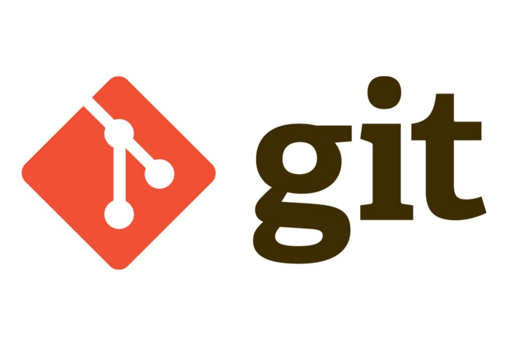

# Инструкция по работе с GIT

LICENSE: [MIT](./license.md)



---

Так же можно посмотреть пример другого logo Git Hub: 


---

## Содержание:
1. **Основы**
2. **Установка**
3. **Настройка**
4. **Создание нового репозитория**
5. **Определиние состояния**
6. **Подготовка файлов** 
7. **Коммит**
8. **Удаленные репозитории**
9. **Ветвление**
10. **Настройка .gitignore**

---

1 **Основы**

***Git*** — это набор консольных утилит, которые отслеживают и фиксируют изменения в файлах (чаще всего речь идет об исходном коде программ, но вы можете использовать его для любых файлов на ваш вкус). С его помощью вы можете откатиться на более старую версию вашего проекта, сравнивать, анализировать, сливать изменения и многое другое. Этот процесс называется контролем версий. Существуют различные системы для контроля версий. Вы, возможно, о них слышали: SVN, Mercurial, Perforce, CVS, Bitkeeper и другие.

Git является распределенным, то есть не зависит от одного центрального сервера, на котором хранятся файлы. Вместо этого он работает полностью локально, сохраняя данные в папках на жестком диске, которые называются репозиторием. Тем не менее, вы можете хранить копию репозитория онлайн, это сильно облегчает работу над одним проектом для нескольких людей. Для этого используются сайты вроде github и bitbucket.

2 **Установка**

Установить git на свою машину очень просто:
Linux — нужно просто открыть терминал и установить приложение при помощи пакетного менеджера вашего дистрибутива. Для Ubuntu команда будет выглядеть следующим образом:

```bash=
sudo apt-get install git
```

Вообще, что такое [bash](./bash.md)?
Windows — мы рекомендуем git for windows, так как он содержит и клиент с графическим интерфейсом, и эмулятор bash.
OS X — проще всего воспользоваться homebrew. После его установки запустите в терминале:

```bash=
brew install git
```

Если вы новичок, клиент с графическим интерфейсом(например GitHub Desktop и Sourcetree) будет полезен, но, тем не менее, знать команды очень важно.

3 **Настройка**

Итак, мы установили git, теперь нужно добавить немного настроек. Есть довольно много опций, с которыми можно играть, но мы настроим самые важные: наше имя пользователя и адрес электронной почты. Откройте терминал и запустите команды:

```bash=
git config --global user.name "My Name"
git config --global user.email myEmail@example.com
```

Теперь каждое наше действие будет отмечено именем и почтой. Таким образом, пользователи всегда будут в курсе, кто отвечает за какие изменения — это вносит порядок.

4 **Создание нового репозитория**

Как мы отметили ранее, git хранит свои файлы и историю прямо в папке проекта. Чтобы создать новый репозиторий, нам нужно открыть терминал, зайти в папку нашего проекта и выполнить команду [init](./init.md). Это включит приложение в этой конкретной папке и создаст скрытую директорию .git, где будет храниться история репозитория и настройки.
Создайте на рабочем столе папку под названием git_exercise. Для этого в окне терминала введите:

```bash=
$ mkdir Desktop/git_exercise/
$ cd Desktop/git_exercise/
$ git init
```

Командная строка должна вернуть что-то вроде:

```bash=
Initialized empty Git repository in /home/user/Desktop/git_exercise/.git/
```

Это значит, что наш репозиторий был успешно создан, но пока что пуст. Теперь создайте текстовый файл под названием hello.txt и сохраните его в директории git_exercise.

5 **Определение состояния** (***[status](./status.md)***)

Запуск git status на нашем свежесозданном репозитории должен выдать:

```bash=
$ git status
On branch master
Initial commit
Untracked files:
(use "git add ..." to include in what will be committed)
hello.txt
```

Сообщение говорит о том, что файл ***hello.txt*** неотслеживаемый. Это значит, что файл новый и система еще не знает, нужно ли следить за изменениями в файле или его можно просто игнорировать. Для того, чтобы начать отслеживать новый файл, нужно его специальным образом объявить.

6 **Подготовка файлов**

В git есть концепция области подготовленных файлов. Можно представить ее как холст, на который наносят изменения, которые нужны в коммите. Сперва он пустой, но затем мы добавляем на него файлы (или части файлов, или даже одиночные строчки) командой add и, наконец, коммитим все нужное в репозиторий (создаем слепок нужного нам состояния) командой commit.
В нашем случае у нас только один файл, так что добавим его:

```bash=
$ git add hello.txt
```

Если нам нужно добавить все, что находится в директории, мы можем использовать:

```bash=
$ git add -A
```
Проверим статус снова, на этот раз мы должны получить другой ответ:

```bash=
$ git status
On branch master
Initial commit
Changes to be committed:
(use "git rm --cached ..." to unstage)
new file: hello.txt
```

Файл готов к коммиту. Сообщение о состоянии также говорит нам о том, какие изменения относительно файла были проведены в области подготовки — в данном случае это новый файл, но файлы могут быть модифицированы или удалены.

7 **Коммит (фиксация изменений)**

[Commit](./commit.md) представляет собой состояние репозитория в определенный момент времени. Это похоже на снапшот, к которому мы можем вернуться и увидеть состояние объектов на определенный момент времени.
Чтобы зафиксировать изменения, нам нужно хотя бы одно изменение в области подготовки (мы только что создали его при помощи git add), после которого мы может коммитить:

```bash=
$ git commit -m "Initial commit."
```
Эта команда создаст новый коммит со всеми изменениями из области подготовки (добавление файла hello.txt). Ключ -m и сообщение «Initial commit.» — это созданное пользователем описание всех изменений, включенных в коммит. Считается хорошей практикой делать коммиты часто и всегда писать содержательные комментарии.

8 **Удаленные репозитории**

Сейчас наш коммит является локальным — существует только в директории .git на нашей файловой системе. Несмотря на то, что сам по себе локальный репозиторий полезен, в большинстве случаев мы хотим поделиться нашей работой или доставить код на сервер, где он будет выполняться.

9 **Ветвление**

Во время разработки новой функциональности считается хорошей практикой работать с копией оригинального проекта, которую называют веткой. Ветви имеют свою собственную историю и изолированные друг от друга изменения до тех пор, пока вы не решаете слить изменения вместе. Это происходит по набору причин:

Уже рабочая, стабильная версия кода сохраняется.
Различные новые функции могут разрабатываться параллельно разными программистами.
Разработчики могут работать с собственными ветками без риска, что кодовая база поменяется из-за чужих изменений.
В случае сомнений, различные реализации одной и той же идеи могут быть разработаны в разных ветках и затем сравниваться.

Более подробно о ветвлении можно узнать здесь Vetvlenie: [vet](./vetvlenie.md)

10. Настройка .gitignore 

Не много подробнее о команде [gitgnore](./git.md)

В большинстве проектов есть файлы или целые директории, в которые мы не хотим (и, скорее всего, не захотим) коммитить. Мы можем удостовериться, что они случайно не попадут в git add -A при помощи файла .gitignore

Создайте вручную файл под названием .gitignore и сохраните его в директорию проекта.
Внутри файла перечислите названия файлов/папок, которые нужно игнорировать, каждый с новой строки.
Файл .gitignore должен быть добавлен, закоммичен и отправлен на сервер, как любой другой файл в проекте.
Вот хорошие примеры файлов, которые нужно игнорировать:

[Logi](./logi.md)
Артефакты систем сборки
Папки node_modules в проектах node.js
Папки, созданные IDE, например, Netbeans или IntelliJ
Разнообразные заметки разработчика.
Файл .gitignore, исключающий все перечисленное выше, будет выглядеть так:

```bash=
*.log
build/
node_modules/
.idea/
my_notes.txt
```
Символ слэша в конце некоторых линий означает директорию (и тот факт, что мы рекурсивно игнорируем все ее содержимое). Звездочка, как обычно, означает шаблон.
Более подробно информацию можно изучить в источниках

[git add](./add.md)


GIT Logo by Matew Vu https://avatars.mds.yandex.net/get-zen_doc/1101877/pub_5c1008a546ef5c00aaa82375_5c1008b446ef5c00aaa82377/orig,
license: [CC BY 3.0](https://creativecommons.org/licenses/by/3.0/)
